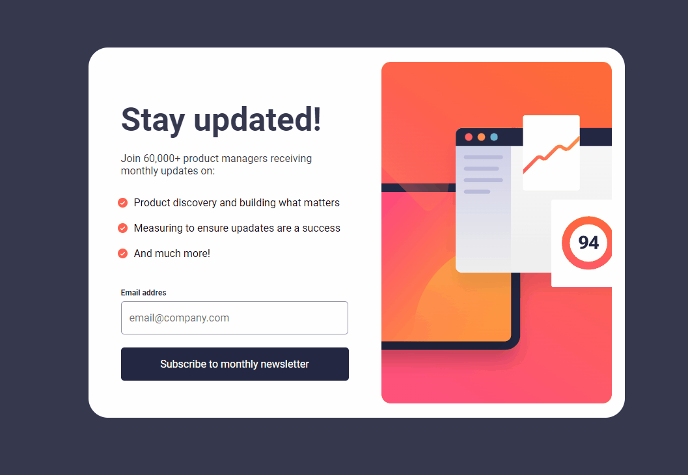
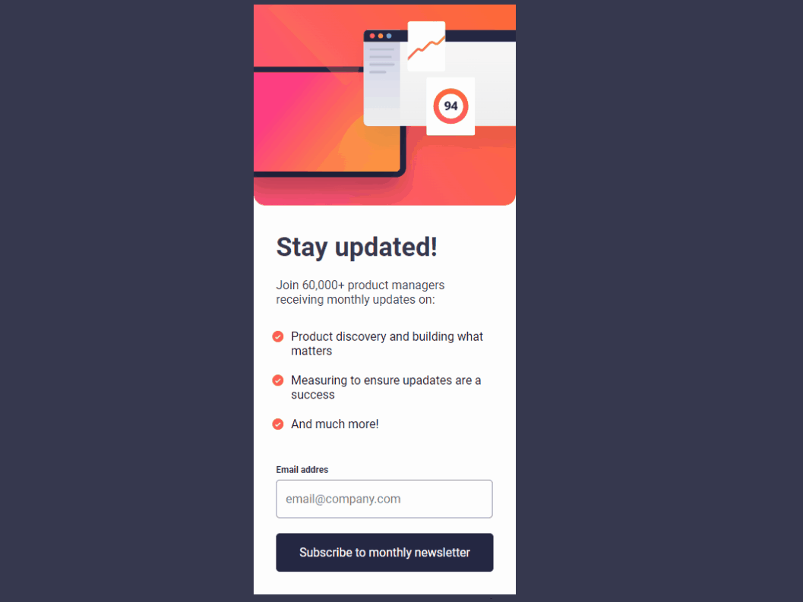

<h1 align = 'center'> Newsletter sign-up form </h1>

 

 

 

## About the Project

This is a project from [Frontend Mentor](https://www.frontendmentor.io/challenges/newsletter-signup-form-with-success-message-3FC1AZbNrv) with the goal of make a Newsletter section totally responsive and with validations for the email input.

### The validations for the email input:

- Input can not be empty;
- Input can not be a invalid email;

### Responsive

- Responsive for the large devices;
- Responsive for the small devices;

 

 

 

<h3 align = 'center'><a href = 'https://jhowbrcg.github.io/newsletter-sign-up-form/'>See the project</a></h3>

 

## Creator

| Author                                                                                                                                      |
| ------------------------------------------------------------------------------------------------------------------------------------------- |
| <a target="_blank" href="https://github.com/JhowBRCG"> </a> |
| &nbsp; &nbsp; &nbsp; Jhonathan                                                                                                              |

